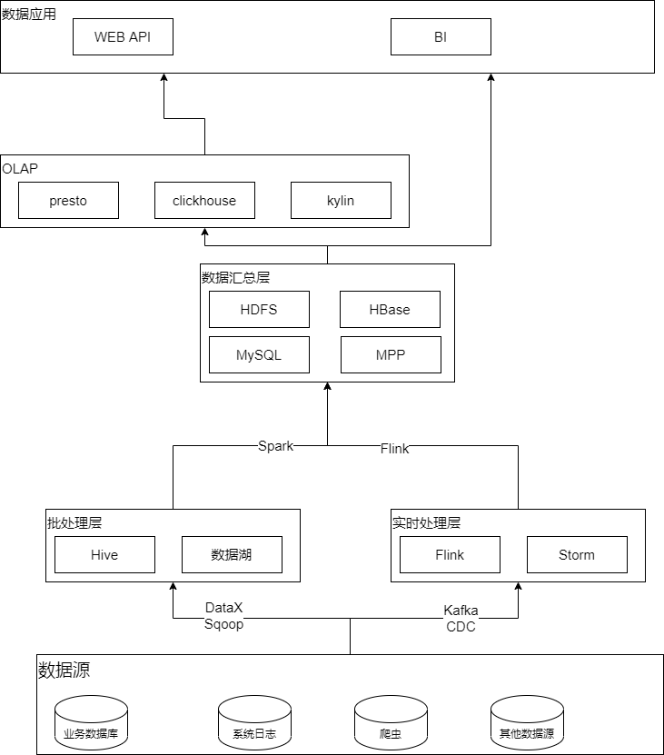

# 题目二：架构设计题
你是某互联网公司的大数据平台架构师，请设计一套基于 Lambda 架构的数据平台架构，要求尽可能多的把课程中涉及的组件添加到该架构图中。并描述 Lambda 架构的优缺点，要求不少于 300 字。

## 解答
### 什么是 Lambda 架构
Lambda 架构是一种数据处理架构，通常有两条加工通路，一条通过实时流处理；另一条利用批处理。  
这种架构方法使用实时流处理来提供低延迟，高吞吐数据处理；另外通过使用离线批处理来提供批处理数据的全面和准确的视图，两个视图输出可以在呈现之前合并。  
Lambda 架构可以在提供低延迟流处理的同时，另外提供一套批处理来保证数据准确性。流处理计算的指标批处理也会计算，最终以批处理为准，即每一次批处理计算之后的结果会覆盖流处理的结果。因此批处理可以看作这是对流处理引擎的一种补充方式。

### Lambda架构设计

#### 架构图

请参考附图 lambda.png:  

#### 架构特点
Lambda 架构包含三层，分别是Batch Processing Layer（批处理层）、Speed (Real-Time) Processing Layer（速度处理层）、Serving Layer（服务层）。

#### Batch Process Layer (批处理层):
- 数据不可改变且数据量不断增长
- 可重新计算视图
#### Real Time process Layer (实时处理层):
- 处理无间断数据流
- 数据量较小
- 实时视图只存在内存中，一段时间后会被丢弃
#### Service Layer （服务层):
- 合并批处理视图和实时试图
- 提供批处理视图和实时试图api

### 优缺点分析
#### Lamda 架构的优势：
- 可扩展性。Lambda 体系架构的实现大多是分布式系统构建的，而分布式系统基本上都是支持水平扩展的，因此，Lambda 架构是具有可扩展性的。
- 通用性。由于 Lambda 体系架构是一般范式，因此用户并不会被锁定在计算批处理视图的某个特定方式中。而且批处理视图和实时处理层的计算，可以被设计为满足某个数据系统的特定需求
- 低延迟的读取和更新。在 Lambda 体系架构中，实时处理层为大数据系统提供了对于最新数据集的实时查询。

#### Lamda 架构的劣势：
- 因为要对数据进行大量存储，并且根据业务需求，两系统可能同时需要占用资源，对资源需求大。
- 部署复杂，需要部署离线及实时计算两套系统，给运维造成的负担比较重。
